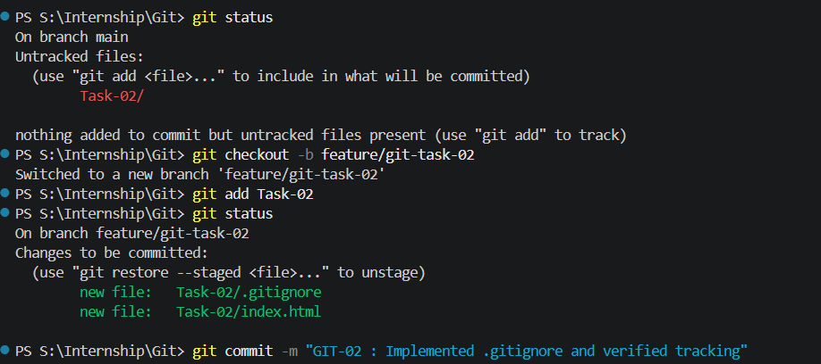

# 📘 GIT:02 Using `.gitignore` and Tracking Files

## 🎯 Objective

Set up a `.gitignore` file to exclude certain files or directories and verify that ignored files are not tracked by Git.

---

## 📋 Requirements

* Create a `.gitignore` file with patterns (e.g., ignoring log files or temporary files).
* Add files that match and do not match the ignore patterns.
* Use `git status` to confirm which files are being tracked.

---

## 🛠️ Steps Performed

### 1. Initialize Task Folder

```bash
mkdir Task02
cd Task02
git init
```

---

### 2. Create Sample Files

Create the following files manually:

* `index.html`
* `app.log`
* `temp.txt`
* `.env`

---

### 3. Add Sample Content

#### index.html

```html
<!DOCTYPE html>
<html>
<head>
  <title>Git Ignore Demo</title>
</head>
<body>
  <h1>Hello Git</h1>
</body>
</html>
```

#### .env

```text
SECRET_KEY=123456
DB_PASSWORD=password
```

---

### 4. Check Status Before `.gitignore`

```bash
git status
```

👉 All files will appear as **untracked**

---

### 5. Create `.gitignore` File 

Add the following content:

```text
# Ignore environment files
.env

# Ignore log files
*.log

# Ignore temp files
temp.txt
```

---

### 6. Verify Ignored Files

```bash
git status
```

👉 Expected:

* `index.html` → visible (tracked)
* `.env`, `app.log`, `temp.txt` → NOT visible (ignored)

---

### 7. Add and Commit Tracked Files

```bash
git add .
git commit -m "GIT:02 Added .gitignore and tracked files"
```

---

### 8. Push to GitHub

```bash
git branch -M main
git remote add origin <your-repo-link>
git push -u origin main
```

---

## 📸 Output



---

## ✅ Outcome

* Created and configured `.gitignore`
* Ignored unnecessary files like `.env`, logs, and temp files
* Verified tracking behavior using `git status`

---

## 🧠 Key Learnings

* `.gitignore` prevents unwanted files from being tracked
* Supports patterns like `*.log` for multiple files
* Only works for **untracked files**

---

## ⚠️ Important Note

If a file was already tracked before adding to `.gitignore`, Git will still track it.

To stop tracking:

```bash
git rm --cached <file-name>
```

---

## 🚀 Conclusion

This task demonstrates how to control file tracking in Git using `.gitignore`, which is essential for maintaining clean and secure repositories.
