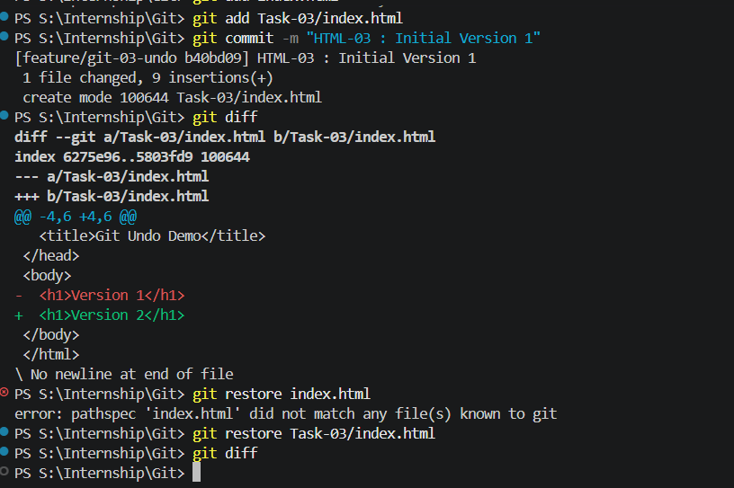
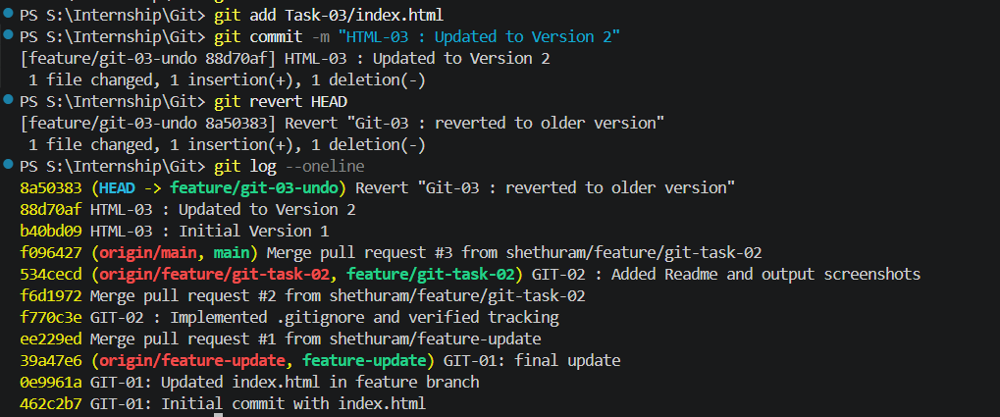
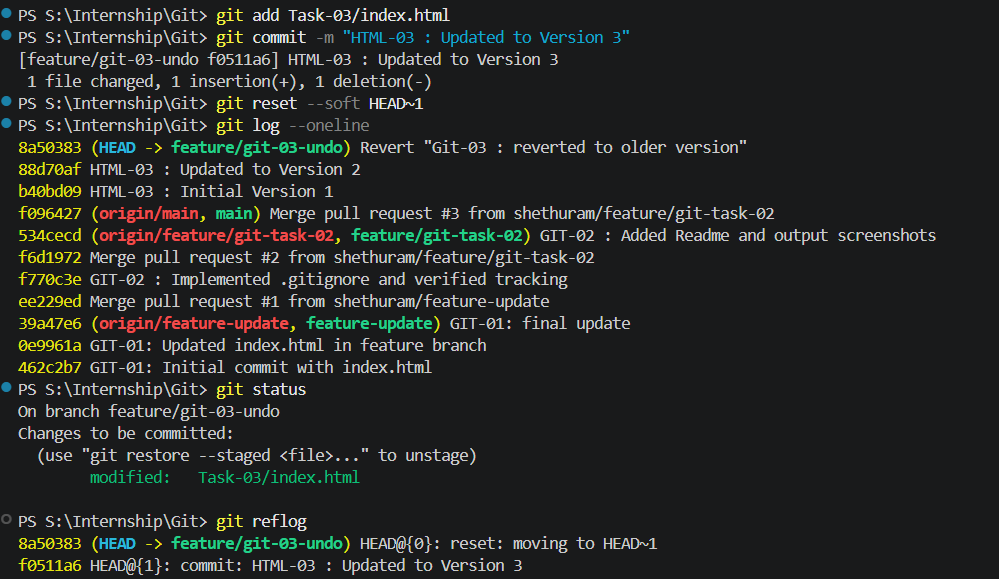

### GIT-03 · Undoing Changes and Reverting Commits

**🎯 Objective:** Experiment with undoing changes in your working directory and commits.

---

**📋 Requirements:**

* Modify a tracked file and use `git restore` to undo changes.
* Make a commit, then use `git revert` and `git reset` to undo commits.
* Understand differences between these approaches.

---

## 🛠️ Steps Performed

---

### 1️⃣ Modify File and Undo (Working Directory)

➡️ Open `index.html` 

Initial content:

```html
<h1>Version 1</h1>
```

⚠️ **IMPORTANT (Required for restore to work):**

First, make sure the file is tracked by committing it once:

```bash
git add index.html
git commit -m "HTML-03 : Initial Version 1"
```

---

Now modify it to:

```html
<h1>Version 2</h1>
```

Check changes:

```bash
git diff
```

Undo changes:

```bash
git restore index.html
```

✔️ File goes back to Version 1

📸 Output:



---

### 2️⃣ Commit Changes and Undo Using `git revert`

Again modify `index.html`:

```html
<h1>Version 2</h1>
```

Commit it:

```bash
git add .
git commit -m "HTML-03 : Updated to Version 2"
```

Undo using revert:

```bash
git revert HEAD
```

✔️ Creates a new commit that reverses the change

📸 Output:



---

### 3️⃣ Undo Commit Using `git reset --soft`

Make change again:

```html
<h1>Version 3</h1>
```

Commit:

```bash
git add .
git commit -m "HTML-03 : Updated to Version 3"
```

Undo commit (keep changes staged):

```bash
git reset --soft HEAD~1
```

Verify:

```bash
git status
git log --oneline
```

✔️ Commit removed, changes still staged

📸 Output:



---

## ✅ Outcome

* Undid uncommitted changes using `git restore`
* Safely reverted a commit using `git revert`
* Removed a commit while keeping changes using `git reset --soft`

---

## 🧠 Key Differences

| Command            | Purpose            | Behavior                     |
| ------------------ | ------------------ | ---------------------------- |
| `git restore`      | Undo local changes | Discards uncommitted changes |
| `git revert`       | Safe undo          | Creates new commit           |
| `git reset --soft` | Undo commit        | Keeps changes staged         |
| `git reset`        | Undo commit        | Keeps changes unstaged       |
| `git reset --hard` | Dangerous          | Deletes everything           |

---

## ⚠️ Notes

* Use `git revert` for shared/public commits
* Use `git reset` only locally
* Avoid `git reset --hard` unless necessary

---


## 🚀 Conclusion

This task demonstrates how to safely and efficiently undo changes in Git using different approaches based on the situation.
