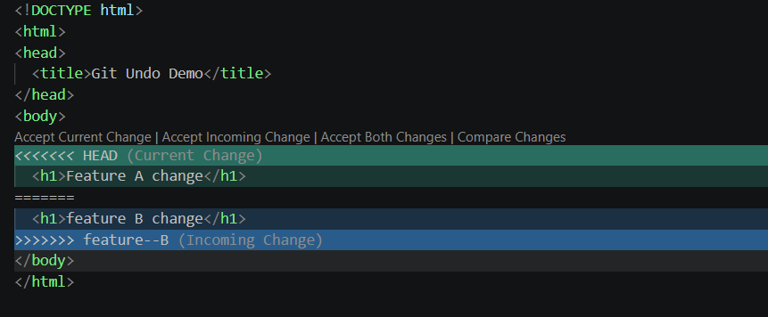

### GIT-04 · Simulating and Resolving Merge Conflicts

**🎯 Objective:** Create a merge conflict scenario and resolve it manually.

---

**📋 Requirements:**

* Create two branches from the same commit
* Modify the same line in both branches
* Merge and observe conflict
* Use `git status` and `git diff` to resolve

---

## 🛠️ Steps Performed

---

### 1️⃣ Initial Setup

➡️ Create `index.html`

```html
<h1>Version 1</h1>
```

```bash
# add and commit initial file
git add index.html
git commit -m "HTML-04 : Initial Version"
```

---

### 2️⃣ Create Two Branches

```bash
# create branch A
git checkout -b feature-A

# go back to main and create another branch
git checkout main
git checkout -b feature-B
```

---

### 3️⃣ Modify Same Line in feature-A

```bash
# switch to feature-A
git checkout feature-A
```

Change file:

```html
<h1>Feature A Change</h1>
```

```bash
# commit changes
git add .
git commit -m "HTML-04 : Feature A change"
```

---

### 4️⃣ Modify Same Line in feature-B

```bash
# switch to feature-B
git checkout feature-B
```

Change file:

```html
<h1>Feature B Change</h1>
```

```bash
# commit changes
git add .
git commit -m "HTML-04 : Feature B change"
```

---

### 5️⃣ Merge and Create Conflict

```bash
# go to feature-A
git checkout feature-A

# try merging feature-B
git merge feature-B
```

❌ Conflict occurs

---

### 6️⃣ Check Conflict

```bash
git status
```

```bash
git diff
```

File will look like:

```html
<<<<<<< HEAD
<h1>Feature A Change</h1>
=======
<h1>Feature B Change</h1>
>>>>>>> feature-B
```

---

### 7️⃣ Resolve Conflict Manually

Edit file:

```html
<h1>Feature A + Feature B Change</h1>
```

```bash
# mark as resolved
git add index.html

# commit merge
git commit -m "HTML-04 : Resolved merge conflict"
```

---

## 📸 Outputs



---

## ✅ Outcome

* Successfully created a merge conflict
* Used `git status` and `git diff` to analyze
* Resolved conflict manually and committed

---

## ⚠️ Notes

* Conflict happens when same line is modified in multiple branches
* Git cannot decide which change to keep
* Manual intervention is required

---

## 🚀 Conclusion

This task demonstrates how Git handles conflicts and how developers resolve them safely during collaboration.
