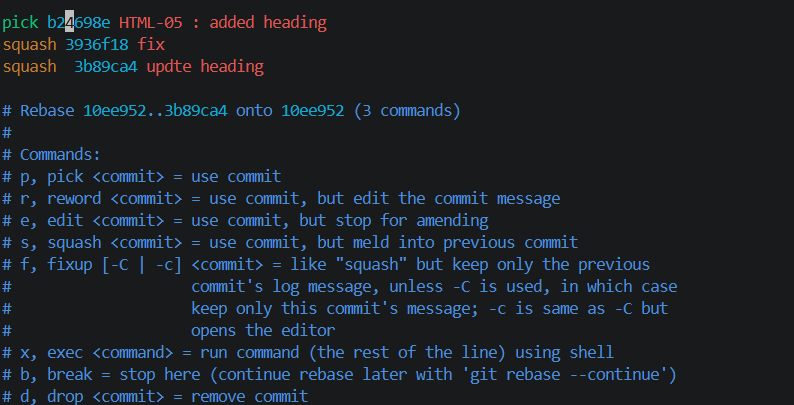
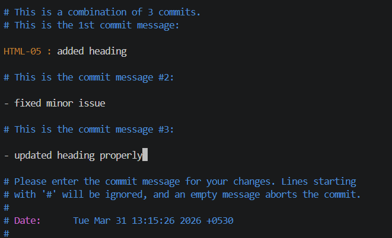

### GIT-05 · Interactive Rebasing for Clean Commit History

**🎯 Objective:** Use interactive rebase to tidy up commit history.

---

**📋 Requirements:**

* Create multiple commits (including minor/typo commits)
* Use `git rebase -i` to squash and edit commits
* Clean up commit history before merging

---

## 🛠️ Steps Performed

---

### 1️⃣ Create Sample Commits

➡️ Modify `index.html`

```html
<h1>Version 1</h1>
```

```bash
# commit 1
git add .
git commit -m "HTML-05 : added heading"
```

Modify again:

```html
<h1>Version 2</h1>
```

```bash
# commit 2 (minor change)
git add .
git commit -m "fix"
```

Modify again:

```html
<h1>Version 3</h1>
```

```bash
# commit 3 (typo message)
git add .
git commit -m "updte heading"
```

---

### 2️⃣ View Commit History

```bash
git log --oneline
```

Example:

```
a1b2c3 updte heading
d4e5f6 fix
g7h8i9 HTML-05 : added heading
```

---

### 3️⃣ Start Interactive Rebase

```bash
git rebase -i HEAD~3
```

---

### 4️⃣ Modify Rebase Plan

Editor opens:

```
pick g7h8i9 HTML-05 : added heading
pick d4e5f6 fix
pick a1b2c3 updte heading
```

Change to:

```
pick g7h8i9 HTML-05 : added heading
squash d4e5f6 fix
squash a1b2c3 updte heading
```

---

### 5️⃣ Edit Commit Message

New editor opens:

```
HTML-05 : added heading

- fixed minor issue
- updated heading properly
```

Save and close

---

### 6️⃣ Verify Clean History

```bash
git log --oneline
```

Output:

```
x1y2z3 HTML-05 : added heading
```

---

## 📸 Outputs


---


---

## ✅ Outcome

* Cleaned up multiple commits into one
* Improved commit message clarity
* Maintained readable project history

---

## 🧠 Interactive Rebase Syntax

```bash
git rebase -i HEAD~n
```

### 👉 Breakdown:

* `-i` → interactive mode (allows editing commits)
* `HEAD` → latest/current commit
* `~n` → number of commits to go back from HEAD

👉 Example:

```bash
git rebase -i HEAD~3
```

✔️ Opens last 3 commits for editing

---

## 🧾 Rebase Commands (Keywords)

| Command  | Meaning                      |
| -------- | ---------------------------- |
| `pick`   | Keep commit as it is         |
| `reword` | Edit commit message          |
| `squash` | Combine with previous commit |
| `edit`   | Modify commit content        |
| `drop`   | Remove commit                |

---

## ⚠️ Notes

* Use rebase only on local branches (not shared history)
* Squash combines multiple commits into one
* Helps maintain clean and professional commit logs

---

## 🚀 Conclusion

Interactive rebase helps maintain a clean, meaningful commit history by squashing unnecessary commits and improving messages before merging.
