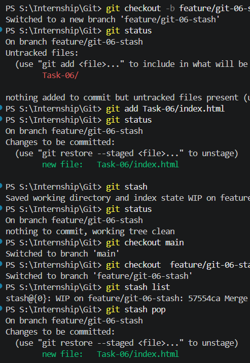

### GIT-06 · Stashing Changes for Context Switching

**🎯 Objective:** Learn how to use Git stash to temporarily save uncommitted changes.

---

**📋 Requirements:**

* Make changes without committing
* Use `git stash` to save work
* Switch branches and work
* Reapply changes using `git stash pop`
* Manage multiple stashes

---

## 🛠️ Steps Performed

---

### 1️⃣ Modify File Without Committing

➡️ Open `index.html`

```html
<h1>Work in Progress</h1>
```

Check status:

```bash
git status
```

---

### 2️⃣ Stash Changes

```bash
# save changes temporarily
git stash
```

Check working directory:

```bash
git status
```

✔️ Working directory becomes clean

---

### 3️⃣ Switch Branch and Work

```bash
# switch to another branch
git checkout main
```

Make some change:

```html
<h1>Main Branch Update</h1>
```

```bash
git add .
git commit -m "HTML-06 : Updated main branch"
```

---

### 4️⃣ Return and Apply Stash

```bash
# go back to previous branch
git checkout -

# apply and remove stash
git stash pop
```

✔️ Changes restored

---

### 5️⃣ Multiple Stashes

```bash
# create multiple stashes
git stash
git stash
```

View stashes:

```bash
git stash list
```

Example:

```
stash@{0}: WIP on feature: changes
stash@{1}: WIP on feature: earlier changes
```

---

### 6️⃣ Apply Specific Stash

```bash
git stash apply stash@{1}
```

---

### 7️⃣ Drop Stash

```bash
git stash drop stash@{1}
```

---

## 📸 Outputs



---

## ✅ Outcome

* Temporarily saved uncommitted work
* Switched context without losing changes
* Managed multiple stashes effectively

---

## 🧠 Stash Behavior (Important)

### Do we need `git add` before stash?

❌ No — for tracked files

```bash
git stash
```

✔️ Saves modified tracked files directly

---

### Untracked Files (New Files)

```bash
touch newfile.html
git stash
```

❌ New file will NOT be stashed

---

### Include Untracked Files

```bash
git stash -u
```

✔️ Stashes tracked + untracked files

---

### Include Ignored Files

```bash
git stash -a
```

✔️ Stashes everything (tracked + untracked + ignored)

---

## 🔥 Additional concepts 

### 🔹 stash is not branch specific

❌ No — stash is **global to the repository**

✔️ You can create stash in one branch and apply it in another

```bash
git stash
git checkout feature-x
git stash apply
```

⚠️ This may cause conflicts if code differs across branches

---

### 🔹 Multiple Stash Concept

Git stores stashes in a **stack (LIFO)**:

```
stash@{0} → latest
stash@{1}
stash@{2}
```

✔️ Each stash represents a separate unfinished work
✔️ Useful when handling multiple tasks simultaneously

---

### 🔹 apply vs pop

| Command           | Behavior                           |
| ----------------- | ---------------------------------- |
| `git stash apply` | Restores changes but keeps stash   |
| `git stash pop`   | Restores changes and removes stash |

👉 Memory trick:

* **apply = restore + keep**
* **pop = restore + delete**

---

### 🔹 Best Practice (🔥 Important)

Use messages for clarity:

```bash
git stash push -m "task-06 navbar changes"
```

View clearly:

```bash
git stash list
```

---

### 🔹 When to Use What?

✔️ Use `apply` → when unsure (safe)
✔️ Use `pop` → when confident (clean workflow)

---

## 🧾 Stash Commands

| Command           | Meaning                 |
| ----------------- | ----------------------- |
| `git stash`       | Save tracked changes    |
| `git stash -u`    | Include untracked files |
| `git stash -a`    | Include ignored files   |
| `git stash list`  | View all stashes        |
| `git stash pop`   | Apply and remove stash  |
| `git stash apply` | Apply without removing  |
| `git stash drop`  | Delete specific stash   |
| `git stash clear` | Remove all stashes      |

---

## ⚠️ Notes

* `git stash` saves uncommitted changes
* Stash is **repository-level (not branch-specific)**
* Multiple stashes are stored in stack order
* `git stash pop` applies and removes stash
* `git stash apply` applies without removing
* Useful for quick context switching

---

## 🚀 Conclusion

Git stash helps developers pause work, switch tasks, and resume later without committing incomplete changes. It is especially powerful when handling multiple parallel tasks efficiently.
