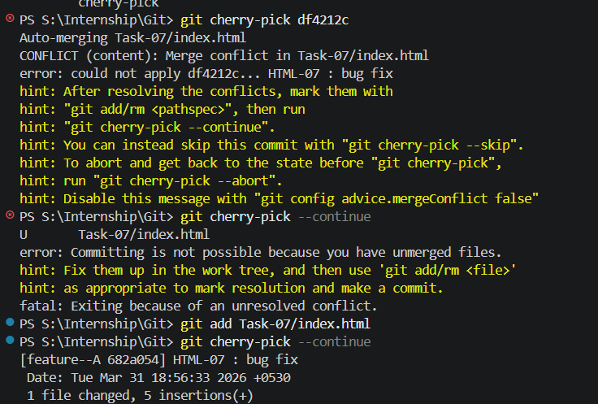
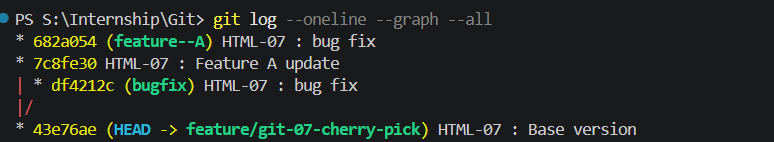

### GIT-07 · Cherry-Picking Commits Between Branches

**🎯 Objective:** Selectively apply a commit from one branch to another using cherry-pick.

---

**📋 Requirements:**

* Create two branches with distinct commits
* Identify a commit to transfer
* Use `git cherry-pick <commit-hash>`
* Handle conflicts if any
* Verify commit history

---

## 🛠️ Steps Performed

---

### 1️⃣ Initial Setup

➡️ Create `index.html`

```html
<h1>Base Version</h1>
```

```bash
git add .
git commit -m "HTML-07 : Base version"
```

---

### 2️⃣ Create Two Branches

```bash
git checkout -b feature-A
```

Modify:

```html
<h1>Feature A Change</h1>
```

```bash
git add .
git commit -m "HTML-07 : Feature A update"
```

---

```bash
git checkout main
git checkout -b feature-B
```

Modify:

```html
<h1>Feature B Change</h1>
```

```bash
git add .
git commit -m "HTML-07 : Feature B update"
```

---

### 3️⃣ Identify Commit Hash

```bash
git log --oneline
```

Example:

```
a1b2c3 HTML-07 : Feature A update
```

---

### 4️⃣ Cherry Pick Commit

```bash
git checkout feature-B
git cherry-pick a1b2c3
```

✔️ Applies Feature A commit into feature-B

---

### 5️⃣ Handle Conflict (if any)

```bash
git status
```

Resolve conflict manually, then:

```bash
git add .
git cherry-pick --continue
```

---

### 6️⃣ Verify History

```bash
git log --oneline
```

✔️ Cherry-picked commit appears in feature-B

---

## 📸 Outputs


---



---

## ✅ Outcome

* Successfully copied a commit between branches
* Understood selective commit transfer
* Verified updated history

---

### Syntax

```bash
git cherry-pick <commit-hash>
```

---

### Important Commands

| Command                      | Meaning                           |
| ---------------------------- | --------------------------------- |
| `git cherry-pick <hash>`     | Apply specific commit             |
| `git cherry-pick --continue` | Continue after resolving conflict |
| `git cherry-pick --abort`    | Cancel cherry-pick                |
| `git log --oneline`          | View commits                      |

---

### When to Use

* Apply a bug fix to another branch
* Move a specific feature without merging entire branch
* Hotfix scenarios

---

### When NOT to Use

* Avoid duplicating large sets of commits
* Avoid when full branch merge is better

---

### ⚠️ Notes

* Cherry-pick creates a NEW commit (not same hash)
* Can cause conflicts if same code is modified
* Use carefully to avoid duplicate history

---

## 🚀 Conclusion

Cherry-picking allows precise control over commits by applying only required changes across branches without merging entire branches.
