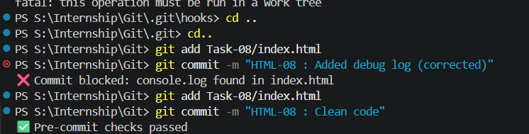

### GIT-08 · Using Git Hooks for Automated Checks

**🎯 Objective:** Set up a Git hook to run scripts (like linters or tests) before commits are finalised.

---

**📋 Requirements:**

* Create a `pre-commit` hook in the `.git/hooks` directory
* Write a simple script (shell) to validate code
* Abort commit if validation fails
* Demonstrate outputs

---

## 🛠️ Steps Performed (VS Code + PowerShell)

---

### 1️⃣ Initial Setup

➡️ Create `index.html`

```html
<!DOCTYPE html>
<html>
<head>
  <title>Git Hooks Demo</title>
</head>
<body>
  <h1>Hello World</h1>
</body>
</html>
```

```bash
# Stage and commit base file
git add .
git commit -m "HTML-08 : Base version"
```

---

### 2️⃣ Create Pre-Commit Hook (Correct Way)

➡️ Open your project in **VS Code**

➡️ Navigate to:

```
.git/hooks/
```

➡️ Create a NEW file:

```
pre-commit
```

❗ Do NOT edit `pre-commit.sample`

---

### 3️⃣ Add Hook Script

➡️ Open `pre-commit` in VS Code and paste:

```bash
#!/bin/sh

# Block commit if "console.log" exists

if grep -q "console.log" index.html; then
  echo "❌ Commit blocked: console.log found in index.html"
  exit 1
fi

# Allow commit

echo "✅ Pre-commit checks passed"
exit 0
```

---

### 4️⃣ Make Hook Executable (Optional on Windows)

```bash
chmod +x .git/hooks/pre-commit
```

✔️ Recommended if using Git Bash
✔️ On Windows, hook may still work without this

---

### 5️⃣ Test Failure Case

➡️ Add debug code in `index.html`

```html
<script>
console.log("debug");
</script>
```

```bash
git add .
git commit -m "HTML-08 : Added debug log"
```

❌ Output:

```
❌ Commit blocked: console.log found in index.html
```

✔️ Commit is NOT created

---

### 6️⃣ Fix and Commit

➡️ Remove `console.log`

```bash
git add .
git commit -m "HTML-08 : Clean code"
```

✅ Output:

```
✅ Pre-commit checks passed
[main abc123] HTML-08 : Clean code
 1 file changed
```

---

## 📸 Outputs



---

## ✅ Outcome

* Prevented bad code from being committed
* Automated validation before commit
* Improved code quality

---

### ⚙️ How It Works

* Git runs `pre-commit` script automatically before every commit
* `exit 0` → allow commit
* `exit 1` → block commit

---


### ⚠️ Important Notes

* Hooks are LOCAL (not pushed to GitHub)
* `.sample` files are ignored by Git
* Only file named exactly `pre-commit` is executed

---

### 🚀 Conclusion

Git hooks act as a safety net by enforcing rules before code enters the repository, ensuring better code quality and reducing bugs in collaborative environments.
