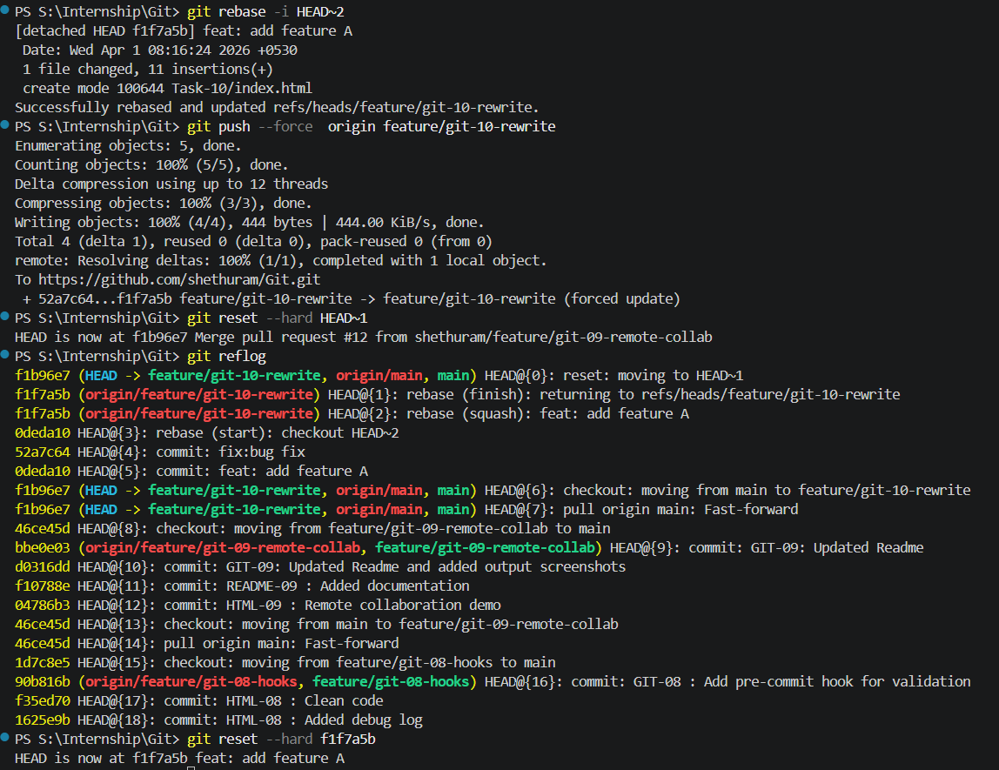

# GIT-10 · Comprehensive Workflow with Forced Pushes and Recovery

## 🎯 Objective

Understand history rewriting, forced pushes, and how to recover lost commits using reflog.

---

## 📋 Requirements

* Work with multiple branches (feature, bugfix, release)
* Rewrite history using interactive rebase
* Perform a forced push
* Recover lost commits using reflog

---

## 🛠️ Steps Performed

---

### 1️⃣ Create Feature Branch

```bash
git checkout main
git pull origin main
git checkout -b feature/git-10-rewrite
```

---

### 2️⃣ Create Commits

```bash
# Create demo files
echo "Feature A" > feature.txt
git add .
git commit -m "feat: add feature A"

echo "Bug Fix" > bugfix.txt
git add .
git commit -m "fix: add bug fix"
```

📌 Output:

```
2 commits created
```

---

### 3️⃣ Push Branch

```bash
git push -u origin feature/git-10-rewrite
```

---

### 4️⃣ Rewrite History (Interactive Rebase)

```bash
git rebase -i HEAD~2
```

👉 Change:

* squash commits
* edit messages

---

### 5️⃣ Force Push

```bash
git push --force
```

📌 Output:

```
forced update
```

---

### 6️⃣ Simulate Mistake

```bash
# Reset to previous state (mistake)
git reset --hard HEAD~1
```

---

### 7️⃣ Recover Using Reflog

```bash
git reflog
```

📌 Output:

```
abc123 HEAD@{0}: reset
xyz789 HEAD@{1}: commit
```

---

### 8️⃣ Restore Commit

```bash
git reset --hard xyz789
```

---

### Task output



---

## ✅ Final Result

* History rewritten successfully
* Forced push applied
* Lost commit recovered using reflog

---

## 📚 Key Learnings

* Rewriting history changes commit hashes
* Force push overwrites remote history
* Reflog helps recover lost commits
* Always use force push carefully

---

## Concepts (Recovery & Internals)

* `git reset` moves the **branch pointer (HEAD)** to a previous commit and updates the working directory and staging area.
* The commits that are no longer referenced become **dangling (unreachable) commits**, but are **not deleted immediately**.
* Git retains these commits for a period of time until **garbage collection (GC)** removes them.
* **Reflog** records HEAD movements (e.g., commits, resets, rebases), allowing you to locate lost commits.
* You can recover a dangling commit using:

```bash
git reset --hard <commit-hash>
```

* Recovery is possible **until garbage collection permanently deletes unreachable commits**.
---
